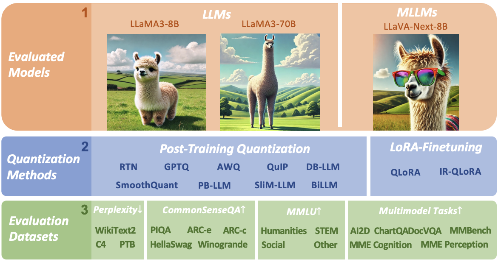
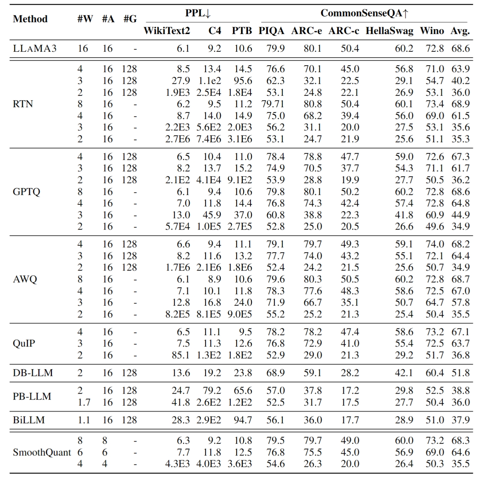
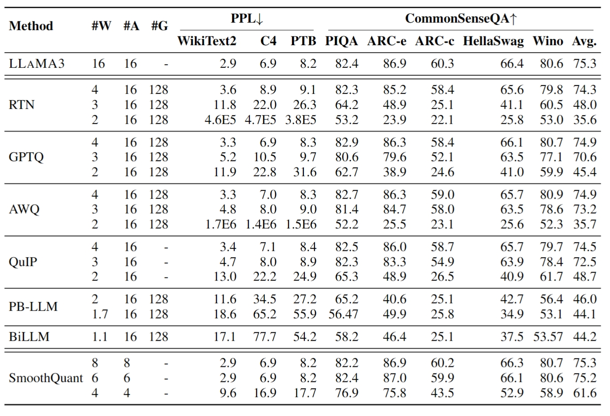
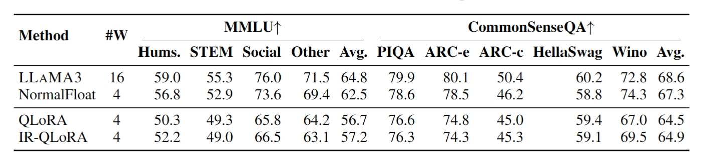

# LLaMA3-Quantization

LLaMA3-Quantization is the official implementation of our paper How Good Are Low-bit Quantized LLAMA3 Models?
An Empirical Study [PDF]. Created by researchers from The University of Hong Kong, Beihang University and ETH Zürich.

## Introduction
Meta's LLaMa family has become one of the most powerful open-source Large Language Model (LLM) series. Notably, LLaMa3 models have recently been released and achieve impressive performance across various with super-large scale pre-training on over 15T tokens of data. Given the wide application of low-bit quantization for LLMs in resource-limited scenarios, we explore LLaMa3's capabilities when quantized to low bit-width. This exploration holds the potential to unveil new insights and challenges for low-bit quantization of LLaMa3 and other forthcoming LLMs, especially in addressing performance degradation problems that suffer in LLM compression. Specifically, we evaluate the 10 existing post-training quantization and LoRA-finetuning methods of LLaMa3 on 1-8 bits and diverse datasets to comprehensively reveal LLaMa3's low-bit quantization performance. Our experiment results indicate that LLaMa3 still suffers non-negligent degradation in these scenarios, especially in ultra-low bit-width. This highlights the significant performance gap under low bit-width that needs to be bridged in future developments. We expect that this empirical study will prove valuable in advancing future models, pushing the LLMs to lower bit-width with higher accuracy for being practical. Our project is released on [https://github.com/Macaronlin/LLaMA3-Quantization](https://github.com/Macaronlin/LLaMA3-Quantization) and quantized LLaMa3 models are released in [https://huggingface.co/LLMQ](https://huggingface.co/LLMQ).



## Usage

We provide full script to evaluate various quantization methods in `./scripts/`. We use LLaMa-3-8B in IR-QLoRA method as an example here:

```shell
python main.py \ 
    --model meta-llama/Meta-Llama-3-8B  \ 
    --peft LLMQ/LLaMA-3-8B-IR-QLoRA \ 
    --tau_range 0.1 --tau_n 100--blocksize 256 \ 
    --epochs 0 \ 
    --output_dir ./log/llama-3-8b-irqlora \ 
    --wbits 4 \ 
    --tasks piqa,arc_easy,arc_challenge,hellaswag,winogrande
```

## Results

### Track1: Post-Training Quantization

- Evaluation results of post-training quantization on LLAMA3-8B model
  

- Evaluation results of post-training quantization on LLAMA3-70B model
  

### Track2: LoRA-FineTuning Quantization
- LoRA-FT on LLAMA3-8B with Alpaca dataset
  

## Related Project

[QUIP](https://github.com/Cornell-RelaxML/QuIP)

[GPTQ: Accurate Post-training Compression for Generative Pretrained Transformers](https://github.com/IST-DASLab/gptq)

[AutoGPTQ](https://github.com/PanQiWei/AutoGPTQ)

[AWQ: Activation-aware Weight Quantization for LLM Compression and Acceleration](https://github.com/mit-han-lab/llm-awq)

[RPTQ: Reorder-Based Post-Training Quantization for Large Language Models](https://github.com/hahnyuan/RPTQ4LLM)

[OmniQuant: Omnidirectionally Calibrated Quantization for Large Language Models](https://github.com/OpenGVLab/OmniQuant)

[PB-LLM: Partially Binarized Large Language Models](https://github.com/hahnyuan/PB-LLM)

[BiLLM: Pushing the Limit of Post-Training Quantization for LLMs](https://github.com/Aaronhuang-778/BiLLM)

[SmoothQuant: Accurate and Efficient Post-Training Quantization for Large Language Models](https://github.com/mit-han-lab/smoothquant)

[QLoRA: Efficient Finetuning of Quantized LLMs](https://github.com/artidoro/qlora)

[IR-QLoRA: Accurate LoRA-Finetuning Quantization of LLMs via Information Retention](https://github.com/htqin/IR-QLoRA)


<!-- ## Citation
If you use our OmniQuant approach in your research, please cite our paper:

```

``` -->